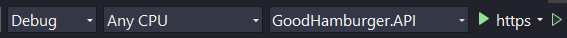
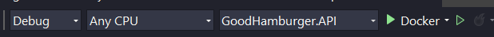

<h1 align="center" id="title">GoodHamburger</h1>

<p id="description">Welcome to GoodHamburger! 🍔</p>

<p>GoodHamburger is an API written in .NET 8 to serve as backend to order placement in restaurants.</p>

<p align="center"></p>

<h2>🧐 Features</h2>

Here're some of the project's best features:

*   Product listing
*   Order placement
*   Order update
*   Order listing

<h2>🛠️ Installation Steps:</h2>

<p>1. Clone the repository on you local machine</p>

<p>2. Run it using visual studio using http or https profile or using dotnet cli inside the src folder within the project GoodHamburger.API</p>

```
dotnet run --launch-profile https
```

<p style="text-align: center">
    
</p>

<p>3. To run the tests use visual studio or the dotnet cli command inside test folder within the GoodHamburger.Unit.Test</p>

```
dotnet test
```

<h2>🐳 Docker support</h2>

<p>This steps requires docker installed in the user machine first.</p>
  
<p>1. To run the application using docker, you can debug it inside visual studio using the profile Docker, or use the docker compose file to create a container. In the root folder, run the command</p>

```
docker compose up --build
```
<p>Using docker compose, after all containers are up the API will be available at [http://localhost:8080](http://localhost:8000.)</p>

<p style="text-align: center">
    
</p>

<h2>💻 Built with</h2>

Technologies used in the project:

*   .NET 8
*   Minimal APIs Architecture
*   Repository Pattern
*   MSTest
*   Entity Framework
*   FluentValidation
*   AutoMapper

<h2>🛡️ License:</h2>

This project is licensed under the MIT License

<h2>✨Future work </h2>

Technologies used in the project:

<p>1. Add integration tests</p>

<p>2. Implement CQRS</p>
